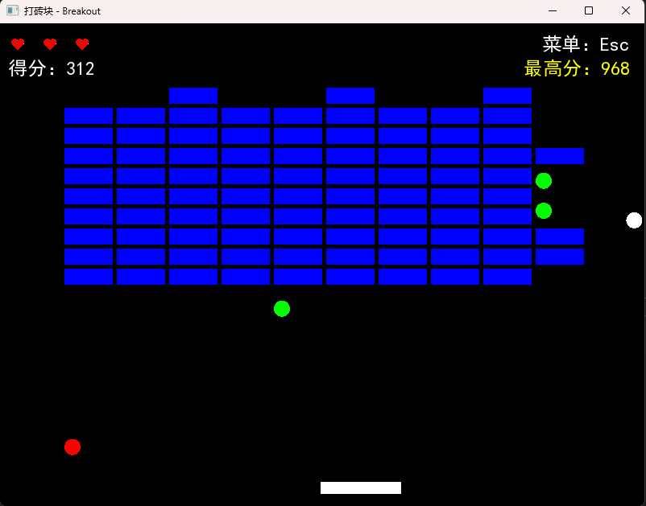

\# Breakout —— 打砖块游戏

基于 C++17 和 SFML 实现的经典打砖块游戏，支持鼠标选择发射方向、道具掉落、最高分记录等功能。

\## 游戏截图

\## 如何运行

\### 环境要求

\- Windows 10/11

\- Visual Studio 2022（或已安装对应的 VC++ 运行库）

\### 下载与运行

1\. 克隆本仓库或直接下载 ZIP 压缩包。

2\. 打开 `Breakout.sln` 解决方案文件。

3\. 设置 `Breakout` 为启动项目，编译并运行（Release 模式）。

> 如果提示缺少 `.dll` 文件，请将 `SFML/bin` 目录下的所有 `.dll` 复制到可执行文件所在目录。

\## 游戏玩法

\- 左右方向键移动挡板。

\- 鼠标点击游戏区域选择小球发射方向，按 `S` 发射。

\- 击碎所有砖块即可通关；小球落底会损失一条生命。

\- 击中砖块有概率掉落道具：

&#x20; - 🔴 红色球：增加一条生命（最多 3 条）

&#x20; - 🔵 蓝色球：加长挡板

&#x20; - 🟢 绿色球：减速小球

\- 每击中一个砖块，小球速度会略微增加，难度逐渐上升。

\- 游戏结束后按 `R` 重新开始，最高分将自动保存。

\## 技术亮点

\- 应用"状态模式"管理菜单、游戏中、暂停、结束等状态。

\- 精确的 AABB 碰撞检测，能区分上下/左右撞击方向，避免小球穿透。

\- 对象池管理掉落物，减少动态内存分配。

\- 最高分持久化存储（文件 I/O）。

\- 集成 SFML 音频模块，增加碰撞音效。

\## 项目结构

\- `Game.h/cpp`：游戏主控类，持有所有游戏数据。

\- `MenuState`, `PlayingState`, `PauseMenuState`, `GameOverState`：状态模式派生类。

\- `Paddle`, `Ball`, `Block`：游戏实体类。

\- `Dropitem` 及其派生类：掉落物系统（生命、加长挡板、减速）。

\## 依赖库

\- \[SFML 2.6.2](https://www.sfml-dev.org/)（图形、窗口、音频）

\## 作者

\- 任毅 - 内蒙古大学 软件工程 2023 级

\## 许可证

\- 仅用于学习交流，请勿用于商业用途。

